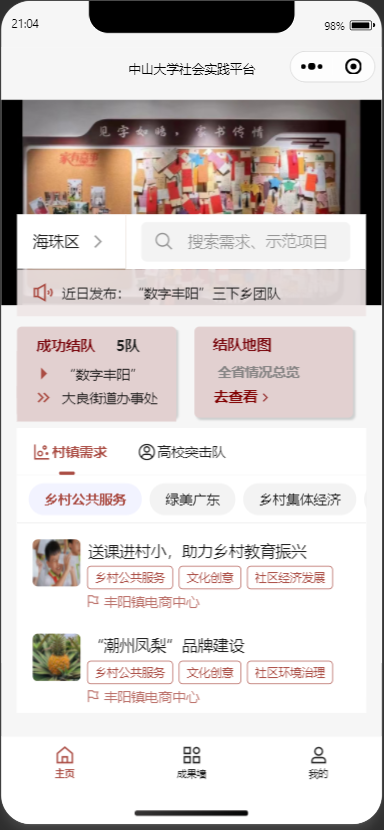
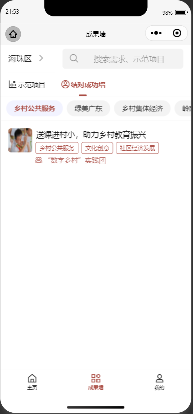
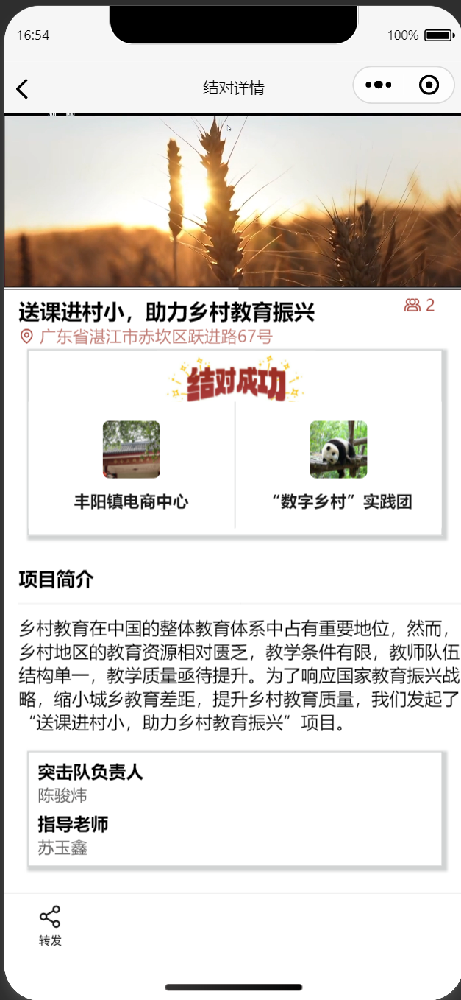
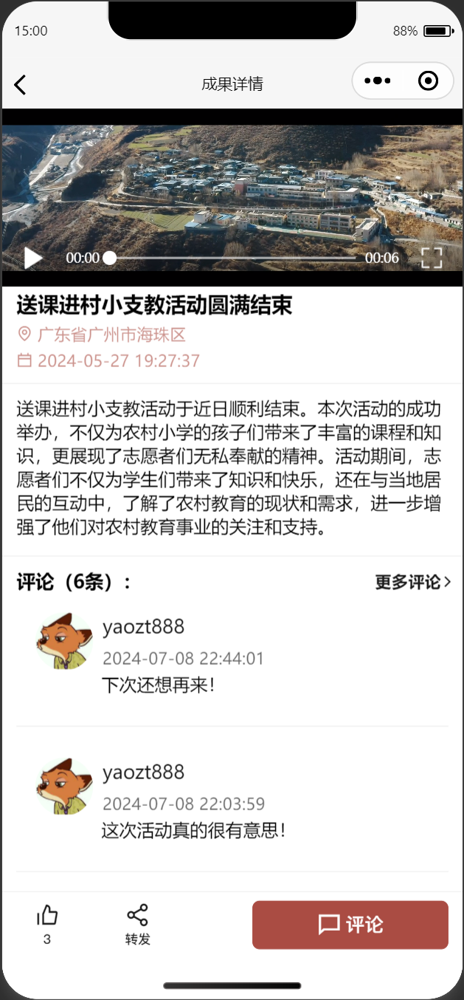

# Social Practice Platform

   

This project is a backend service repository based on Java and Spring Boot, focused on providing demand-matching functionality between communities and university task forces.

## Screenshot

<table>
  <tr>
    <td></td>
    <td></td>
    <td></td>
    <td></td>
  </tr>
</table>

## Feature

- **Login Module**: Users can choose different identities when logging in. There are five types of identities: student, teacher, community leader, university youth league, and guest (unauthenticated). The platform has set different access permissions for each identity.

- **General Module**: All users, regardless of their identity, can view the latest published demands, paired demands, and published results on the homepage. Additionally, users can search for specific demands or results through the search module.

- **Team Formation Module**: Students can team up with other students on the platform and invite teachers as advisors for university teams. Teams can connect with community demands as a unit.

- **Publish Demand**: Community leaders can register their communities on the platform. After approval, they can publish community demands. Upon receiving a matching request, the community leader is notified and can choose whether to accept the match.

- **Publish Results**: After a student team completes a community demand, they can publish their results and upload videos and images to showcase their achievements during the activity in a more personalized way.

- **Review Module**: To ensure the authenticity and legality of platform content, student team creation, demand publishing, and result publishing all require review by the university youth league. Additionally, university teams need to apply for matching with communities, and community leaders must confirm the application.

- **Map Module**: We have integrated a map feature, allowing users to view detailed information about community locations and statistics on paired projects. Furthermore, community leaders can search and select location information directly through the map when registering their community.

- **Interactive Module**: To enhance interaction and engagement on the platform, we have designed an interactive module. Users can comment and like the published results. These interactions will notify the result publisher (either university teams or community leaders).

## Contributer

A big shout out to all the contributers, more specifically to these guys

- [Flora1003Xu](https://github.com/Flora1003Xu)
- [Lin1Yx](https://github.com/Lin1Yx)
- [yzt](https://github.com/6yaozt)
- [Fcat003](https://github.com/Fcat003)

## Notes
if port 3306 is occupied, run the command below:

`netstat -ano | findstr :3306`
`taskkill /PID {对应进程号} /F`
